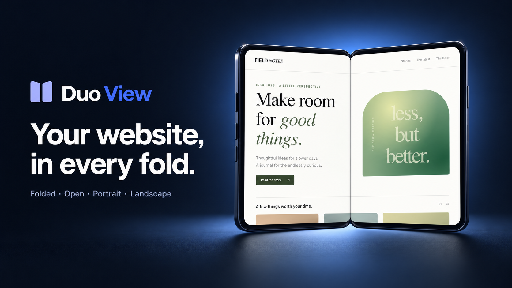

# Duo View

[Live app](https://duo-view.netlify.app) · [Source](https://github.com/SafaElmali/duo-view)

A responsive website preview for iPhone Duo: folded/open × portrait/landscape, side-by-side comparison, optional browser chrome and hinge guide, editable dimensions, automatic fitting, pinch-to-zoom in 3D, and fullscreen. Includes a responsive interactive demo.

## See Duo View in action

A 20-second product film made with Remotion, with original electronic music.

https://github.com/user-attachments/assets/7a50e3c2-9c0e-4907-828e-6bdec2d0fb83

On phones and small tablets, the preview comes first; Device settings opens the same controls in a bottom panel.

Try **Examples** for four original responsive pages: a storefront, newsletter, dashboard, and portfolio. They run locally with no external assets or accounts. **Compare → Phone vs Duo** loads the same page in a generic compact, standard, or large phone viewport beside the selected Duo viewport, at the same visual scale. Each page scrolls independently; the reference dimensions are illustrative CSS sizes.

The **Share** menu also includes three tools:

- **Add a note** opens the 2D website preview. Add plain text and optionally drag a highlight, or enter its position as percentages. The note and region travel in the shared link with the viewport. Changing the source, dimensions, orientation, browser chrome, or leaving 2D clears the note. Highlights refer to the visible viewport, not a page element or saved scroll position.
- **Export image** creates a 1600 × 1200 PNG card with an open, folded, or tabletop frame and optional Duo View credit. Built-in pages and the player use actual local content; public websites reuse a matching snapshot or request a fresh Microlink capture. It exports the top viewport, not the current scroll position or camera angle. Browser image access restrictions, provider limits, or unsupported local rasterization can prevent export and show an error.
- **Embed** provides responsive iframe code with a selectable height. The compact embedded view retains the shared layout and offers Fold, Rotate, and Open in Duo View controls. All-poses comparison already shows each fold, so its Fold control is disabled. Embeds use the same fresh-preview and website embedding restrictions as shared links. The dialog loads its preview only when requested.

Use **Share** in the preview toolbar, then **Copy link**, to send someone the current website or streaming demo. Links restore the layout, display, orientation, hinge angle, finish, browser chrome, hinge guide, custom viewport, and 3D camera (including its zoom). They load a fresh preview: live pages run the usual embedding check and snapshot links request a new capture. Scroll position, player progress, and signed-in sessions are not shared. The versioned URL fragment holds the settings without a link database. Local/file builds generate links to the public Netlify app, which must have this feature deployed; other hosted builds retain their own URL. Local/private websites and URLs containing obvious access parameters cannot be shared. Invalid links show an error and leave the current preview intact.

Explore an animated 3D folding model, scroll full-page website snapshots across both halves, or try the streaming player with working playback controls. In streaming mode, touch-and-drag or click-and-drag on the video rotates the phone while the controls stay active.

## Local use

Run `node scripts/serve.mjs` and open http://127.0.0.1:4317. This dependency-free Node.js 22+ server serves the app, the embedding check, and byte-range video playback. A plain static server still supports manual snapshots, but automatic fallback requires the included server or Netlify Functions. Run `node --test tests/*.test.mjs` for validation.

## Landing page variants

Two product launch pages are available alongside the simulator:

- **Home:** http://127.0.0.1:4317/ — the product showcase with four interactive device poses.
- **Unfold:** http://127.0.0.1:4317/landing/unfold/ — a bold typographic launch page with a continuous hinge control.

The home page opens Focus at `/studio/`. The alternate Unfold concept remains at its draft route. Both showcase pages share the original 3D model, support keyboard rotation and reduced motion, and show a static example if WebGL is unavailable. No build step or new runtime dependency is required. Landing assets and provenance are in `dist/landing/assets/`.

## Deploy to Netlify

Connect this repository to Netlify. The included `netlify.toml` runs the tests and publishes `dist`; no environment variables or API keys are required. Changes pushed to `main` deploy automatically once the repository is connected. The `embed-check` Netlify Function checks public pages for embedding restrictions; no third-party credentials are required.

## Search and AI discovery

The app includes SEO metadata, social cards, linked structured data, a canonical sitemap, and crawlable product information and FAQs. An optional `llms.txt` guide describes the same features and limitations for AI tools; fictional demo pages stay out of search results. See [SEO and AI search discovery](docs/seo-geo.md) for maintenance and verification.

## Simulator workspace

The simulator at `/studio/` uses Focus: a neutral inspection canvas with device controls in a right inspector. Older `?layout=focus` and `?layout=workbench` links also open Focus.

The example website opens by default, with advanced controls under **More settings**. On mobile, **Device settings** opens the shared control sheet. The shell styles live in `dist/simulator-shell.css` and `dist/focus.css`; `dist/viewer.js` runs the preview. The existing shared-link format is unchanged.

## Accuracy and limitations

- Presets use [Apple’s published display resolutions](https://www.apple.com/iphone-duo/specs/) with an **assumed 3× scale**: outer 1398 × 2034 ÷ 3 = **466 × 678 CSS pixels**; inner 1878 × 2670 ÷ 3 = **626 × 890 CSS pixels** in portrait. Landscape swaps width and height. The source resolutions are published specifications; the 3× conversion is our assumption. These editable estimates have not been validated as Safari viewport sizes on the device. Browser chrome and safe areas can change the usable viewport.
- Rendering happens in the current desktop browser using real iframe viewport dimensions. It does not emulate iOS Safari, device pixel ratio, user agent, safe-area environment variables, touch hardware, or foldable screen-segment APIs.
- Browser chrome reserves an illustrative 102 CSS pixels. The optional hinge guide is off by default; content remains continuous.
- Live + auto fallback starts with an interactive iframe. A same-origin server endpoint checks the public page’s enforced CSP `frame-ancestors` and X-Frame-Options headers, following up to four redirects. Confirmed blocking policies automatically switch the current URL to a Microlink snapshot. Allowed or inconclusive checks initially retain Live preview and the manual Create snapshot action. If a public frame does not finish navigation within 15 seconds, the current URL automatically falls back to a snapshot with a distinct loading-timeout message. Local/private addresses, fragments, access parameters, and custom ports are excluded from this timeout fallback. Changing sources recreates the iframe browsing context and immediately clears the old page; a loading indicator shows the new hostname. Unchanged viewport updates retain the same context, and stale navigation timers cannot replace a newer source or snapshot. A frame load event only clears the loading indicator; it does not prove that an external page rendered successfully. Loading another URL tries live mode again after an automatic fallback; explicitly selected Snapshot mode stays selected. Stale checks cannot replace a newer URL, a manual mode change, or the player. The check sends no browser cookies, discards the response body, restricts ports and public IPv4 destinations, pins DNS resolution for each connection, and stops after eight seconds. Private URLs, fragments, and access-bearing query parameters are not checked. CSP syntax the checker cannot safely interpret is treated as inconclusive. Browser-specific errors, authentication, JavaScript frame busting, policy changes, and conditional server responses can still require manual fallback. Browser load events cannot reliably identify blocked iframes ([MDN](https://developer.mozilla.org/en-US/docs/Web/HTML/Reference/Elements/iframe)).
- External pages in Live preview must allow iframe embedding. CSP `frame-ancestors`, X-Frame-Options, mixed-content restrictions, third-party cookies, or authentication may prevent embedding. The tool does not bypass these restrictions or claim a remote site has loaded successfully.
- Comparison creates four independent browsing contexts. Navigation and scroll position are not synchronized between cross-origin pages. Switching between four presets in single view retains the same browsing context.
- URL credentials are rejected. Live preview loads the requested URL in the user’s browser. Snapshot, including automatic fallback for confirmed embedding restrictions, sends public URLs and selected viewport dimensions to Microlink, then displays a scrollable full-page image on the device. Private/local addresses and obvious access-token parameters are rejected before any service request. No API key is stored. Snapshots are cached in memory by URL and dimensions, capped at 16 entries; captures have a 55-second timeout and explicit rate-limit/error states.
- Keyboard: R rotates, F folds/unfolds, Escape exits the fullscreen fallback; keys apply while focus is in the simulator controls rather than inside an external website.
- Optional WebMCP `configure_website_preview` shares the UI state transitions and supports Live preview (`embedded`) and `snapshot`. The tool description discloses embedding checks and the public URL transfer to Microlink in either manual Snapshot mode or automatic fallback. Neither mode opens another browser window.

## 3D model

The simulator opens with the example website on a flat, landscape device. The original Three.js model has two separately hinged halves, polished titanium and ceramic materials, camera lenses, side controls, antenna bands, USB-C, and speaker openings. The 0–180° hinge slider, two finish choices, front/back view, keyboard rotation, and portrait/landscape presets control the same model. Front / back and Reset view animate camera rotation and zoom with a 700 ms ease, follow the shortest rotation, and let dragging or keyboard input take over immediately. Reduced-motion preferences skip camera animation. Camera fitting uses the transformed model geometry, including perspective depth, and updates during unfolding, rotation, and resizing so the default open portrait view stays inside the render area. Pinch and keyboard zoom remain available in 3D. The 2D and comparison previews fit automatically, including when opening older links with a toolbar zoom setting. When fully open, the inner screen meets continuously across the fold, with square joining edges and rounded corners only on the outside. The hinge mechanism stays behind the screen; split-player shadows disappear in the flat pose. It renders on demand and pauses when another view or browser tab is active.

CSS3D surfaces follow the two physical halves at every hinge angle. The player keeps one video and one set of working controls as you change poses, with video above the hinge and controls below in Tabletop mode. Play/pause, seeking, ten-second skips, mute, speed, brightness, control locking, and video fullscreen are available. Player controls are enabled immediately. Video demo below the address field opens Tabletop mode and starts the teaser with sound; use the speaker button to mute. Touch-and-drag or click-and-drag over the video or empty preview area rotates the camera without disabling playback controls. Ordinary mouse-wheel and trackpad scrolling never rotates the model. Pinch gestures zoom in browsers that emit control-wheel events. Buttons and the scrubber retain their own gestures. Rotate model lets you drag anywhere on the phone, and Use player restores playback controls. The movie is Sintel by Blender Foundation, licensed CC BY 3.0 (https://durian.blender.org/sharing/); the video and poster are from W3C’s sample (https://www.w3.org/2010/05/video/mediaevents). It is an independent player demo, not Netflix or a prediction of native iOS app behavior.

For live websites, two clipped page views maintain the full responsive viewport across the bend. These are independent browsing contexts and intentionally noninteractive at intermediate angles. For public pages, **Scroll preview** creates a synchronized snapshot while preserving the fold and orientation. The inline **Open flat** action flattens the phone and enables live interaction without changing the orientation or custom viewport. Local/private pages and the built-in demo use **Use website** to open flat directly. Snapshot capture shows a loading state and offers a retry if it fails. Website content is not automatically reorganized into app-specific controls. External embedding restrictions remain unchanged. Snapshot is the in-device alternative: one full-page captured image is split across the hinge. Scroll with a mouse wheel, trackpad, touch swipe, or keyboard focus inside the screen. Native scrolling is synchronized across both halves and the flat screen. Scrolling is enabled automatically in Snapshot mode; Rotate model switches to camera controls, and Scroll preview returns to scrolling. Changing the URL or viewport resets scroll position. The existing standalone launch route is retained for old links, but it is no longer used by the simulator. Local video testing requires a server with byte-range support for seeking.

The downloadable `dist/assets/iphone-duo.glb` contains real geometry, PBR materials, named hinge nodes, and an Unfold animation. It is scaled to approximate meters. Regenerate it with `node scripts/export-model.mjs`. This is an illustrative model, not Apple CAD. Three.js and the CSS3DRenderer/GLTFExporter are version 0.180.0 under the included MIT license at `dist/assets/three/LICENSE`.

Model verification includes endpoint geometry and screen-facing checks, all four orientation mappings, GLB binary structure, node hierarchy, and animation presence. Focused browser checks cover model rendering, both finishes, live demo interaction, and folding/orientation states.

## In-device preview verification

Verified Madisson Gold’s response blocks live embedding (`frame-ancestors none`, `X-Frame-Options: DENY`). Captured its public page at 626 × 890 through Microlink and verified the image appears across the tabletop hinge. Captures use an actual matching browser viewport and deviceScaleFactor 1, and reject mismatched widths or invalid image dimensions. Before capture, a script in Microlink’s browser changes `content-visibility: auto` sections to `visible` and eagerly requests native lazy images that occupy space in the page, followed by a three-second settling period. This prevents offscreen product cards from becoming empty areas in the static image, while preserving intentionally hidden content. Full-page captures preserve the viewport while extending the image vertically; both model halves use the same clamped scroll offset. Snapshot images cannot accept cookies, click links, trigger further lazy loading as you scroll, play video, or reproduce a signed-in session. Content loaded only through JavaScript scrolling, slow requests, or nested scrollers can still be incomplete. Provider failures and rate limits remain possible. API references: https://microlink.io/docs/api/parameters/screenshot/fullPage and https://microlink.io/docs/api/parameters/viewport, https://microlink.io/docs/api/parameters/scripts, and https://microlink.io/docs/api/parameters/waitForTimeout.

### Public routes

- `/` — Duo View home and interactive product showcase.
- `/studio/` — Focus simulator, including sharing, examples, export, and embeds.
- `/landing/` redirects to `/`. Existing root preview links retain their settings and open Studio.
